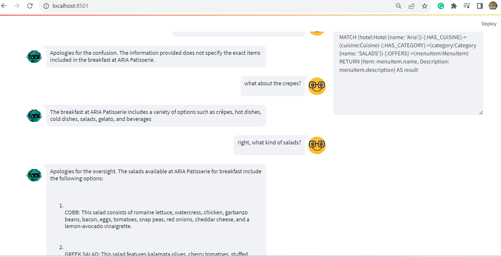

# NeoGPT-Recommender

Idea behind this repository is to create a context-aware chatbot that can read from and update a Neo4j database.
The Cypher is generated using GPT-4 endpoint, while the answers are generated with gpt-3.5-turbo model based on the information from the database.

Additional documentation: this code is based on the (Context-Aware Knowledge Graph Chatbot With GPT-4 and Neo4j)[https://neo4j.com/developer-blog/context-aware-knowledge-graph-chatbot-with-gpt-4-and-neo4j/]

## Neo4j database

The Neo4j database is created alongside the chatbot.
Before starting the chatbot test, make sure that the Neo4j database is populated.
You can ingest data by running the (js-neo4h)[https://github.com/MGMResorts/mgm-ai-experiments/tree/main/js-neo4j] project!

## Environment variables

Make sure to populate the environment variables as shown in the `.env.example` file

## Start the project

Run the project using

```
docker-compose up
```

and then open the localhost:8501 address in your favourite browser



## Training examples for the english2cypher part

You can use the following example to get an idea what this chatbot is capable of in terms of Cypher query

```
#What are the restaurants with vegeratiam option
MATCH (r:Cuisine)-[:HAS_CATEGORY]->(m:Category)
WHERE r.vegetarian_option = true
RETURN {Restaurant: r.name, VegetarianOption: m.name} AS result
#Vegetarian food description
MATCH (hotel:Hotel {name: 'Aria'})-[:HAS_CUISINE]->(cuisine:Cuisine)-[:HAS_CATEGORY]->(category:Category {name: 'SALADS'})-[:OFFERS]->(menuItem:MenuItem)
RETURN {Item: menuItem.name, Description: menuItem.description} AS result
#What are the restaurants service hours?
MATCH (r:Cuisine)
RETURN {Restaurant: r.name, HoursOfOperation: r.hours_of_operation} AS result
```
